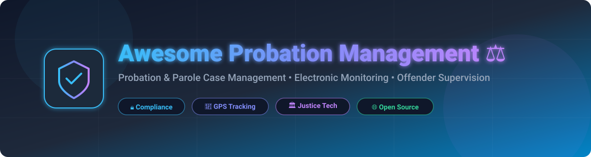

# Awesome Probation Management ⚖️

  

  
  
  
  
  
  

## 📌 Top Probation Management Platforms Ecosystem

**Curated List of SaaS Products & Open-Source GitHub Projects** 🚀  
*Focused on Probation & Parole Case Management, Electronic Monitoring, Offender Supervision, Risk Assessment & Community Corrections*  

📅 **Last updated: August 2026**

---

### 💡 Overview & Scope

This repository tracks notable **SaaS platforms** and **open-source projects** for **Probation Management** and community supervision. These tools help probation and parole agencies manage caseloads 📋, track compliance ⏱️, support electronic monitoring (GPS/RF/Alcohol) 📡, conduct risk/needs assessments (COMPAS/LSI-R) 📊, schedule officer visits 📅, and improve rehabilitation outcomes for individuals under community supervision.

**Enterprise SaaS Examples** include Tyler Supervision, Attenti (Allied Universal), BI TotalAccess, SuperCom, TrackGroup, Omnigo, Corrisoft, Equivant Probation, Pioneer Technology Group (Catalis), and Judicial Innovations.

**Open-Source Emphasis**: This section is heavily expanded with major active open-source repositories for sentence planning 📜, case management engines ⚙️, offender tracking scripts 💻, and open justice technology — ideal for agencies, researchers, and developers seeking transparent or self-hosted alternatives in offender supervision.

🤝 **Contributions welcome!** Open a PR to add/update entries. Keep descriptions factual and link to official sites.

---

## 📑 Table of Contents
- [🏢 SaaS/Hosted Platforms](#-saashosted-platforms)
- [🔓 Open-Source GitHub Projects](#-open-source-github-projects)
- [🤝 How to Contribute](#-how-to-contribute)
- [⚠️ Disclaimer](#%EF%B8%8F-disclaimer)
- [📈 Star History](#-star-history)

---

## 🏢 SaaS/Hosted Platforms

| Platform 🌐 | Description 📝 | Company Valuation / Revenue 💰 | Pricing 💲 | Free Tier / Trial Limits 🎁 |
| :--- | :--- | :--- | :--- | :--- |
| **[Tyler Supervision](https://www.tylertech.com/products/tyler-supervision)** | Enterprise cloud-based supervision case management system for pretrial, adult and juvenile probation, and parole agencies. | **~$12.5 Billion Market Cap** (~$2.3B+ Annual Revenue) | Custom annual enterprise SaaS subscription quote based on jurisdiction size, user count, and module selection. | No free for ever plan; enterprise demo & pilot scoping available upon agency request. |
| **[Attenti](https://www.attentigroup.com/)** | Electronic monitoring and offender management technology provider serving probation, parole, and corrections markets worldwide (Allied Universal). | **~$160 Million Revenue** (Parent: Allied Universal ~$20B+ Revenue) | Starts at ~$1.40 - $3.30/day per participant for RF monitoring; ~$4.00 - $4.30/day for active GPS tracking. | No free for ever plan; agency evaluation and trial deployments arranged by sales request. |
| **[SuperCom](https://www.supercom.com/)** | Global provider of electronic monitoring hardware and software (PureSecurity suite) for probation, parole, and community corrections programs. | **~$65 Million Market Cap** (~$27.9M Annual Revenue) | Starts at ~$1.50/day per participant for PureShield victim notification; ~$10.00 - $55.00/day for full house arrest/GPS suites. | No free for ever plan; agency pilot and evaluation programs granted via formal RFP / sales request. |
| **[Omnigo](https://www.omnigo.com/)** | Public safety and incident management platform that supports probation and community supervision operations. | **~$42.9 Million Valuation** (~$19M - $23M Annual Revenue) | Annual subscription based on custom quotes; basic organizational software modules historically start around ~$115/month. | No free for ever plan; interactive live software demonstration available upon request. |
| **[TrackGroup](https://www.trackgrp.com/)** | End-to-end electronic monitoring and location-based supervision solutions with analytics for criminal justice agencies. | **~$27 Million Market Cap** (~$35.2M Annual Revenue) | Starts at ~$1.98/day per user for Empower app; ~$5.25 - $5.75/day per active ReliAlert GPS device. | No free for ever plan; agency pilot program provided via formal RFP request. |
| **[Corrisoft](https://www.corrisoft.com/)** | Electronic monitoring and offender supervision solutions combining GPS devices, smartphone apps, and case management tools for probation and parole agencies. | **~$25 Million - $50 Million Revenue (Est.)** | Starts at ~$0.68 - $0.70/day per participant for check-in app; ~$5.00/day for AIR Mobile Phone & ~$3.75/day for BLUtag GPS. | No free for ever plan or self-serve free trial; agency demonstration & pilot program available upon request. |
| **[Pioneer Technology Group](https://www.pioneertechnology.com/)** | Justice and public safety software solutions (Benchmark) that include probation and case tracking capabilities (Acquired by Catalis). | **~$25 Million Total Funding** (~$11M Annual Revenue) | Custom enterprise quotes; starting module deployments historically priced from ~$5,000/year for small court jurisdictions. | No free for ever plan; free custom product demonstration available upon request. |
| **[Equivant Probation](https://www.equivant.com/)** | Case management and supervision tools focused on probation, pretrial, and community corrections workflows. | **~$14.1 Million Annual Revenue (Est.)** | Custom agency quotes; enterprise licensing and maintenance contracts typically start around ~$86,000/year for local county setups. | No free for ever plan; personalized sales demo and agency needs assessment available upon request. |
| **[BI TotalAccess / BI Incorporated](https://bi.com/)** | Comprehensive electronic monitoring and community supervision platform offering GPS, RF, and alcohol monitoring integrated with case management. | **Private Division** (Parent: GEO Group ~$2.4B Revenue) | Starts at ~$0.96/day per participant for SmartLINK app; ~$2.74 - $4.20+/day for GPS ankle monitoring. | No free for ever plan; customized pilot evaluations arranged per agency upon request. |
| **[Judicial Innovations](https://www.judicialinnovations.com/)** | Technology solutions tailored for courts and justice agencies, including supervision and payment tracking features (Avenu Insights). | **Acquired by Avenu** (Processes >$150M in Annual Payments) | $0 core cost for government agencies (funded via end-user processing fees per payment transaction). | Core software platform provided at $0 cost to government agencies; free software demo offered upon request. |

---

## 🔓 Open-Source GitHub Projects

The following list of open-source probation management, sentence planning, and case tracking tools is sorted by GitHub star count in descending order:

1. **[LawLink](https://github.com/lawflow-boop/LawLink)**   
   ⚖️ Open-source, self-hosted case and practice management system that provides a foundation for case tracking, offender notes, and workflow management adaptable to justice contexts.

2. **[WKS Platform](https://github.com/wkspower/wks-platform)**   
   ⚙️ Open-source adaptive case management platform built on Camunda, suitable for complex, unstructured case workflows including supervision processes.

3. **[OSCaR – Open Source Case Management](https://github.com/Children-in-Families/oscar-web)**   
   📋 Open-source case management and reporting system originally developed for social services that can be adapted for structured offender supervision and case tracking.

4. **[HMPPS Probation Integration Services](https://github.com/ministryofjustice/hmpps-probation-integration-services)**   
   🔌 Open-source integration service built by the UK Ministry of Justice to connect probation management services, risk assessment APIs, and external offender systems.

5. **[BC Community Corrections Case Management (CCCM)](https://github.com/bcgov/jag-community-corrections-case-management)**   
   🏛️ Open-source community corrections case management system developed by the Government of British Columbia for probation and related supervision workflows.

6. **[Foreman (Forensic Case Management)](https://github.com/ubunteroz/foreman)**   
   🔍 Open-source forensic case management system focused on organizing cases, officer tasks, digital evidence, and audit trails.

7. **[HMPPS Sentence Plan UI (UK Ministry of Justice)](https://github.com/ministryofjustice/hmpps-sentence-plan-ui)**   
   📜 Open-source sentence planning interface developed for the UK Probation Service to support structured rehabilitation planning for individuals under supervision.

8. **[HMPPS Manage People on Probation UI](https://github.com/ministryofjustice/hmpps-manage-people-on-probation-ui)**   
   📱 Open-source front-end application built by the UK Ministry of Justice for probation officers to view offender details, supervision appointments, and compliance status.

9. **[Probation OSS Framework](https://github.com/ossrndc/Probation-OSS)**   
   🛠️ Open-source probation research and development framework for managing offender tracking logs, risk assessment models, and supervision task distribution.

10. **[Parole & Probation Field Tools](https://github.com/agrc/parole-and-probation)**   
    🗺️ Open-source GIS web applications developed for parole officers to support visit planning and field supervision mapping.

---

### 💡 Additional Open-Source Options & Building Blocks

- **🏛️ Government-led projects**: UK HMPPS Probation Services suite and BC CCCM represent production-oriented open efforts in community corrections.
- **⚙️ Case management cores**: Low-code adaptive engines like WKS Platform and LawLink can be customized for complex offender supervision workflows.
- **📊 Research & Risk Assessment**: Open risk assessment prototypes and decision-support algorithms adapted for offender classification.
- **📡 Electronic Monitoring Processors**: Community scripts for parsing GPS location streams and generating compliance violation reports.

---

## 🤝 How to Contribute

1. 🍴 Fork the repository.
2. ✏️ Add/edit entries in `README.md` (maintain exact table/list sorting).
3. 📝 Include name, website link, 1–2 sentence factual description, and metrics.
4. 🚀 Submit a PR with a short explanation of your changes.

⭐ **Star the repo if you find it useful!**

---

## ⚠️ Disclaimer

- This is a **community-curated** list — not exhaustive and not an official endorsement.
- Probation and electronic monitoring systems handle highly sensitive criminal justice data; they are subject to strict legal, privacy, security, and procurement requirements.
- Self-hosted or open-source solutions must undergo thorough security assessment, compliance review, and validation before operational deployment.

---

## 📈 Star History

<a href="https://www.star-history.com/?repos=ishandutta2007%2FAwesome-Probation-Management&type=date&legend=bottom-right">
<picture>
<source media="(prefers-color-scheme: dark)" srcset="https://api.star-history.com/chart?repos=ishandutta2007/Awesome-Probation-Management&type=date&theme=dark&legend=bottom-right" />
<source media="(prefers-color-scheme: light)" srcset="https://api.star-history.com/chart?repos=ishandutta2007/Awesome-Probation-Management&type=date&legend=bottom-right" />

</picture>
</a>

---

**Made for probation officers 👮‍♂️, community corrections agencies 🏛️, justice technology teams 💻, and legal tech researchers 🔬.**  
*Let's make supervision technology more transparent, accountable, and focused on positive rehabilitation outcomes!* ⚖️✨
